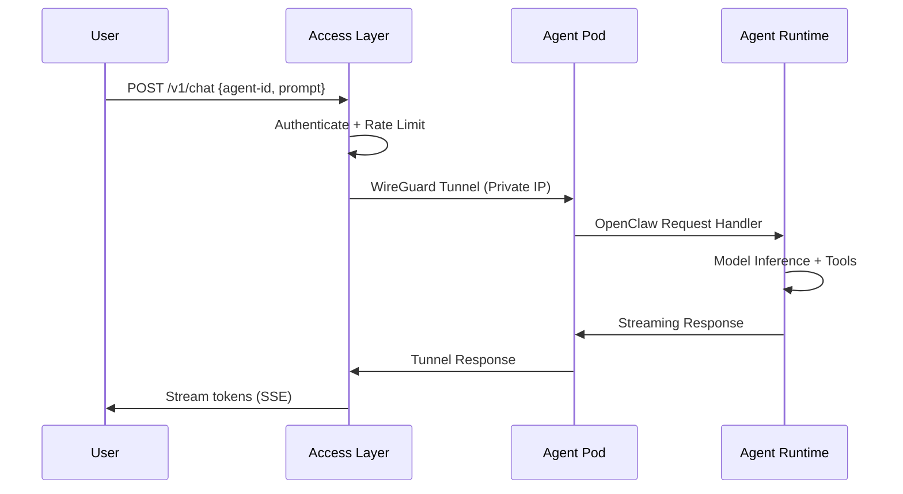

# Agent Access

## Overview

Every MoltGhost agent receives a **stable, secure HTTPS endpoint** for interaction.

Users communicate via standard APIs without direct compute access, leveraging MoltGhost's managed networking layer.

```
https://<agent-id>.agent.moltghost.io/v1/chat
https://<agent-id>.agent.moltghost.io/v1/tools
https://<agent-id>.agent.moltghost.io/v1/status
```

---

## Endpoint Architecture

```
┌──────────────────────┐    ┌─────────────────────────────┐
│      User/Client     │───▶│   MoltGhost Access Layer    │
│  (API/UI/Integrations)│    │  (Cloudflare Workers)       │
└──────────────────────┘    └─────────────────────────────┘
                                     │
                                     ▼
┌──────────────────────┐    ┌─────────────────────────────┐
│    Agent Pod         │◄───│     Internal Network        │
│  (Private IP)        │    │     (WireGuard Tunnel)      │
└──────────────────────┘    └─────────────────────────────┘
```

**Key Benefits:**
- ✅ Zero public port exposure on Pods
- ✅ Global CDN acceleration
- ✅ Automatic HTTPS + TLS termination
- ✅ DDoS protection + rate limiting

---

## Request Routing Flow



**Latency Profile:**
```
User → CDN Edge: 20ms
Edge → Access Layer: 10ms  
Access → Pod: 50ms (WireGuard)
Pod Processing: 200-2000ms
Total: ~300-2100ms (Global)
```

---

## Endpoint Lifecycle

| Agent State | Endpoint Status | Behavior |
|-------------|-----------------|----------|
| **Deploying** | `https://pending-<id>.agent.moltghost.io` | 404 until ready |
| **Running** | `https://<agent-id>.agent.moltghost.io` | ✅ Full access |
| **Paused** | `https://<agent-id>.agent.moltghost.io` | 503 (Service Unavailable) |
| **Terminated** | Endpoint deleted | 410 (Gone) |

**Stable Naming Guarantee:**
```bash
# Deploy → Instant endpoint
AGENT_ID=$(moltghost deploy my-agent)
echo "Endpoint: https://$AGENT_ID.agent.moltghost.io"

# Endpoint survives restarts
moltghost agent stop my-agent   # Endpoint → 503
moltghost agent start my-agent  # Endpoint → ✅ Active
```

---

## API Specifications

### Chat Completions
```bash
curl -X POST https://<agent-id>.agent.moltghost.io/v1/chat \
  -H "Authorization: Bearer $API_KEY" \
  -H "Content-Type: application/json" \
  -d '{
    "messages": [{"role": "user", "content": "Analyze Q4 sales"}],
    "stream": true
  }'
```

### Tool Calling
```bash
curl -X POST https://<agent-id>.agent.moltghost.io/v1/tools \
  -d '{
    "prompt": "Check inventory levels",
    "tools": ["crm_query", "warehouse_api"]
  }'
```

**OpenAI Compatible** - Works with any OpenAI SDK.

---

## Security Model

```
┌─────────────────────────────────────────────────────────────┐
│                  Zero Trust Networking                      │
├─────────────────────────────────────────────────────────────┤
│  ✅ API Key Authentication (per-agent keys)                 │
│  ✅ Rate Limiting (100 RPM default)                         │
│  ✅ DDoS Protection (Cloudflare)                            │
│  ✅ HTTPS Only (TLS 1.3)                                    │
│  ✅ No Pod Public IPs                                       │
│  ✅ Request Signing (optional)                              │
│  ✅ Audit Logs (all interactions)                           │
└─────────────────────────────────────────────────────────────┘
```

**Infrastructure Protection:**
- Agent Pods → Private VPC only
- WireGuard tunnels → Encrypted overlay
- Access Layer → Ephemeral Workers
- No SSH/Direct access → API only

---

## Global Distribution

```
🌍 350+ Edge Locations → <1% Packet Loss → 99.99% Uptime SLA

Asia: Singapore, Jakarta, Tokyo
Europe: Frankfurt, London, Paris  
US: Ashburn, LA, Chicago
```

**Multi-Region Agent Deployment:**
```bash
moltghost deploy my-agent --region ap-southeast-1 --replicas 3
```

---

## Summary

**Agent Access = Production-Ready Connectivity**

✅ **Instant HTTPS endpoints** on deploy  
✅ **Global CDN acceleration** (`<300ms` TTFT)  
✅ **Zero infrastructure exposure** (private Pods)  
✅ **OpenAI-compatible APIs**  
✅ **Built-in security + scaling**  

**Deploy once → Access everywhere** through managed, secure endpoints.

---

*Next: Scaling & HA → Multi-pod deployments and failover*

**Quick Test:**
```bash
curl https://demo-agent.agent.moltghost.io/v1/health  # Returns agent status
```
