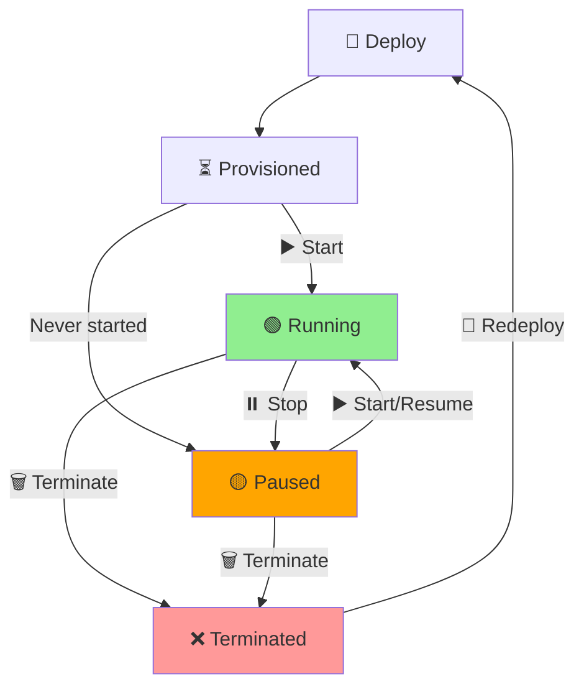

# Agent Lifecycle

## Overview

Agents progress through predictable states to optimize compute costs and availability.

```
Deploy → [Start ↔ Stop] → Terminate
         ↑
      Resume
```

**Key Benefits:**
- **Pause anytime** → Save 95% compute costs
- **State preserved** → Resume instantly  
- **Predictable billing** → Per-second granularity

---

## Lifecycle Flow



---

## State Details

| State | Endpoint | Compute | Data | Use Case |
|-------|----------|---------|------|----------|
| **🚀 Deploy** | 202 Accepted | Provisioning | Creating | Initial setup |
| **🟢 Running** | ✅ Active | GPU/CPU/Mem | Live | Production |
| **🟡 Paused** | 503 Unavailable | Storage only | **Preserved** | Cost savings |
| **❌ Terminated** | Gone | None | Backup (30d) | Cleanup |

---

## Management Commands

```bash
# Core lifecycle
moltghost agent start   my-agent     # ▶️  Resume (45s)
moltghost agent stop    my-agent     # ⏸️  Pause (-95% cost)
moltghost agent delete  my-agent     # 🗑️  Terminate

# Smart defaults
moltghost agent pause    my-agent    # Auto-stop if idle
moltghost agent resume   my-agent    # Smart start

# Bulk operations
moltghost agent stop dev-*           # Pause all dev agents
moltghost agent start prod-*         # Start production fleet
```

---

## Cost Impact

```
Running  (A100 80GB): $2.50/hour
Paused             : $0.12/hour  ← 95% savings
Terminated         : $0.00/hour

Monthly Example:
- Always-on: $1,800
- Smart pause: $450  ← 75% savings
```

**Auto-Policy:**
```bash
moltghost agent set my-agent --auto-pause "15m idle"
```

---

## Summary

**Simple states, powerful control:**

✅ **Deploy** → Create infrastructure  
✅ **Start/Stop** → Control costs precisely  
✅ **Terminate** → Clean resource release  
✅ **Data always safe** → Pause/resume anytime  

**Lifecycle mastery = cost mastery.**
