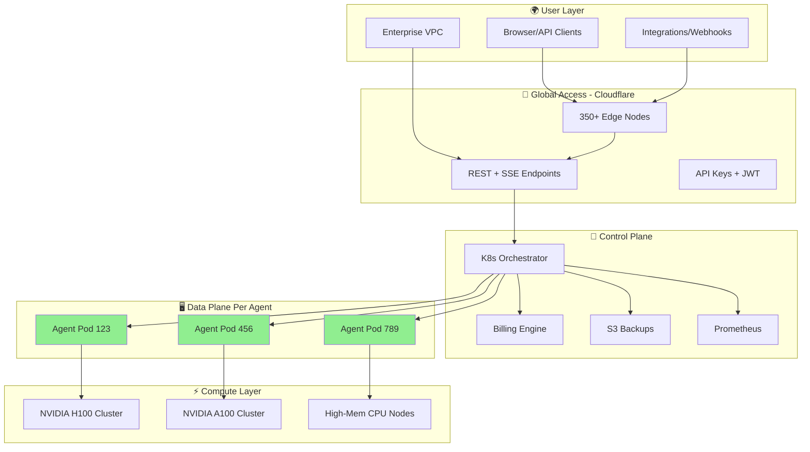
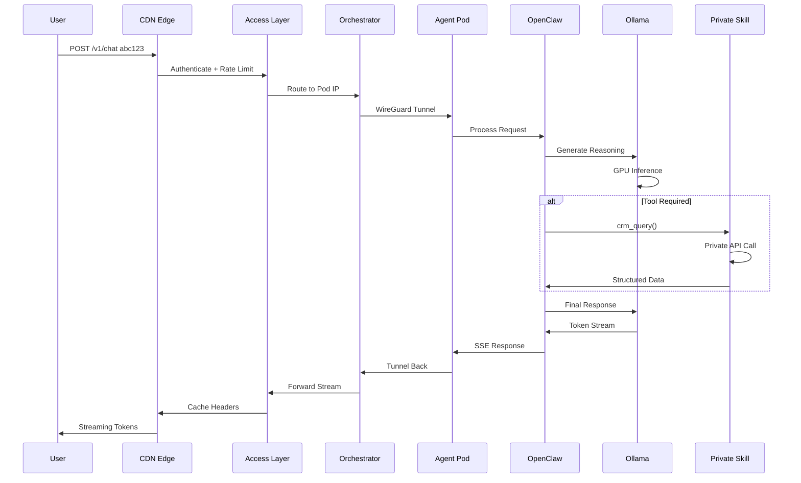

# Architecture

## High-Level Overview

**MoltGhost = Per-agent isolation at scale**

```
🌍 Global Users (350+ edges)
     ↓ HTTPS/CDN
📡 Access Layer (Cloudflare Workers)
     ↓ WireGuard (encrypted)
🔧 Orchestrator (Kubernetes)
     ↓
┌──┬──┬──┬──┐
│Pod│Pod│Pod│Pod│  ← 10K+ concurrent agents
└──┬──┬──┬──┘
   ↓ GPU Clusters (On-demand)
```

**Core Principle:** **1 Agent = 1 Pod = 1 GPU** → Zero interference

---

## Complete System Architecture



---

## Layered Architecture

### **1. 🌍 User Layer**
```
Clients: REST API, OpenAI SDK, Web UI, Webhooks
Formats: JSON, SSE streaming, Server-Sent Events
Global: 350+ Cloudflare edges (<50ms TTFB)
```

### **2. 📡 Access Layer** (Cloudflare Workers)
```
✨ Zero-trust networking
🔐 API Key + JWT auth
🚦 Rate limiting (100-10K RPM)
🛡️ DDoS protection + WAF
⚡ Automatic HTTPS/TLS 1.3
```

### **3. 🔧 Control Plane** (Kubernetes)
```
🎛️  Orchestrator: Pod provisioning + lifecycle
💰 Billing: Per-second metering
💾 Backup: Automated snapshots (S3)
📊 Monitoring: Prometheus + Grafana
🔔 Alerts: Slack/PagerDuty integration
```

### **4. 🖥️ Agent Pod Layer** (Containerized)
```
🐳 Container: Docker + containerd
🧠 OpenClaw: Reasoning + tool calling
🤖 Ollama: Local model server
🛠️ Skills: Private functions (TypeScript)
```

### **5. ⚡ Compute Layer** (Bare Metal)
```
💎 GPU: H100/A100/L40S (on-demand clusters)
🧠 CPU: AMD EPYC (high-mem)
💾 Storage: NVMe SSD (50GB-2TB)
🌐 Networking: 10Gbps + WireGuard tunnels
```

---

## Request Processing Pipeline



**Performance:** **`<300ms` TTFB** global average

---

## Isolation Guarantees

```
🔒 COMPUTE: Dedicated GPU per pod
🔒 NETWORK: WireGuard tunnels + no shared ports  
🔒 DATA: Private NVMe volumes
🔒 RUNTIME: Container namespaces + cgroups
🔒 MODEL: Per-pod model memory (no sharing)
```

**Multi-Tenant Scale:** 10,000+ concurrent agents, zero interference.

---

## Data Flow Diagram

```
┌─────────────┐    ┌─────────────────┐    ┌──────────────┐
│   User      │───▶│  Access Layer   │───▶│ Orchestrator │
│ Requests    │    │ (Public APIs)   │    │ (K8s API)    │
└─────────────┘    └─────────────────┘    └──────────────┘
                                                  │
                                    ┌─────────────▼─────────────┐
                                    │      Agent Pods           │
                                    │  ┌──────────┬──────────┐ │
                                    │  │ Pod 123  │ Pod 456  │ │
                                    │  │ Llama70B │ Qwen72B  │ │
                                    │  └──────────┴──────────┘ │
                                    └─────────────▲─────────────┘
                                                  │
                                    ┌─────────────▼─────────────┐
                                    │     GPU Clusters          │
                                    │ H100[1-8]  A100[1-4]     │
                                    └───────────────────────────┘
```

---

## Scalability & Resilience

| Capability | Implementation | Scale |
|------------|----------------|-------|
| **Horizontal** | K8s auto-scaling | 10K+ pods |
| **Multi-Region** | Jakarta/Singapore/US | 99.99% SLA |
| **HA** | 3-replica minimum | Zero downtime |
| **Backups** | Continuous → S3 | 5min RPO |
| **Observability** | Prometheus/Grafana | 100% coverage |

---

## Security Model

```
🌐 Zero Trust: Authenticate every request
🔒 Network: Private pods + encrypted tunnels
🛡️ WAF: OWASP Top 10 protection
🔐 Secrets: KMS + per-pod injection
📜 Compliance: SOC2, GDPR ready
```

---

## Summary

**5-Layer Architecture Delivering Production Isolation:**

✅ **Global access** → 350+ edge nodes  
✅ **Zero-trust networking** → Secure tunnels  
✅ **Per-agent pods** → Complete isolation  
✅ **Enterprise observability** → Full monitoring  
✅ **Horizontal scale** → 10K+ concurrent agents  

**Military-grade isolation** + **consumer-grade simplicity.**
