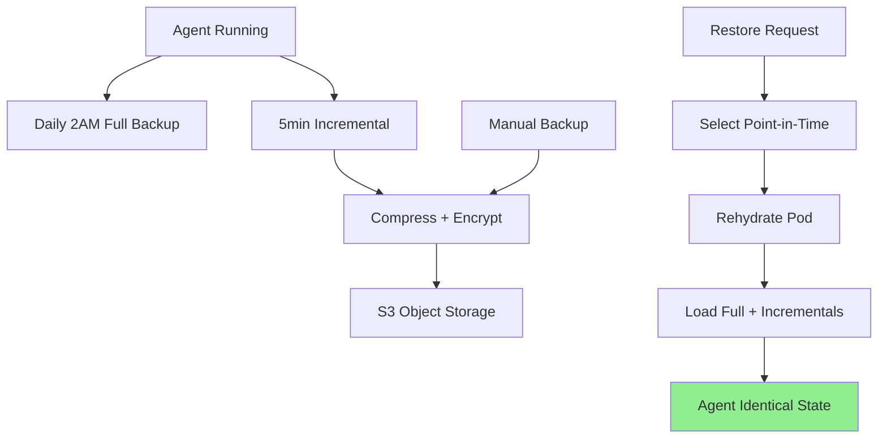

# Backup & Restore

## Overview

MoltGhost's **automated backup system** preserves complete agent state—configuration, memory, skills, and runtime data.

**Point-in-time recovery** ensures agents resume exactly where they left off, even after termination or failure.

```
Agent State → Incremental Backup → S3 Storage → Restore → Identical Agent
```

---

## What Gets Backed Up

**Complete Agent Snapshot** (daily automated + manual):

| Component | Data Captured | Size Estimate |
|-----------|---------------|---------------|
| **Configuration** | Model, skills, env vars | ~1KB |
| **OpenClaw State** | Memory, conversation history | 10KB-10MB |
| **Skills Config** | Private skill definitions + auth | 5-50KB |
| **Runtime Settings** | Tool definitions, prompts | ~5KB |
| **Custom Data** | User-defined persistent storage | Unlimited |

```
Total Backup Size: 1MB (chat agent) → 500MB+ (enterprise w/ long memory)
```

---

## Backup Architecture

```
┌─────────────────────────────────────────────────────────────┐
│                       Agent Pod                             │
├─────────────────────────────────────────────────────────────┤
│  Agent Runtime ───────┐                                    │
│     │                  │ Incremental Changes                │
│     ▼                  ▼                                    │
│  ┌──────────────┐     ┌──────────────┐                     │
│  │ Daily Full    │◄───┼──► Backup Log │                     │
│  │ Backup        │    │ (PostgreSQL)  │                     │
│  └──────────────┘     └──────────────┘                     │
│                        │                                    │
│                        ▼                                    │
│              ┌─────────────────────────────┐                │
│              │ Encrypted S3 Storage        │◄── Retention ───│
│              │ (AWS/GCP/Azure)             │   (7-365 days)  │
│              └─────────────────────────────┘                │
└─────────────────────────────────────────────────────────────┘
```

**Backup Types:**
- **Daily Full** (2:00 AM WIB) - 100% state capture
- **Incremental** (5min intervals) - Changes only
- **Manual** (`moltghost backup create`)

---

## Backup Lifecycle



**Retention Policies:**
```
Free: 7 days (3 full backups)
Pro: 30 days (30 full backups) 
Enterprise: 365 days + custom
```

---

## Restore Process

**Zero-Downtime Recovery** in 60-300 seconds:

```bash
# List available backups
moltghost backup list my-agent
# 2026-03-05T02:00:00Z  [FULL]  2.3MB
# 2026-03-04T14:30:00Z  [MANUAL] 1.8MB

# Restore to new/existing agent
moltghost restore my-agent-backup --target my-agent-restored

# Or point-in-time recovery
moltghost restore my-agent --timestamp 2026-03-04T14:30:00Z
```

**Restore Flow:**
```
1. Provision identical Pod spec
2. Download full + incrementals  
3. Decrypt + decompress (AES-256)
4. Rehydrate OpenClaw memory
5. Resume skills + configuration
6. Health check → Endpoint active ✅
```

---

## Use Cases

| Scenario | Command | Time to Recovery |
|----------|---------|------------------|
| **Accidental Delete** | `moltghost restore latest` | 60s |
| **Config Mistake** | `moltghost restore --timestamp X` | 90s |
| **Pod Failure** | Auto-restore on deploy | 120s |
| **Migration** | `moltghost export → import` | 5min |
| **Disaster Recovery** | Cross-region restore | 5-10min |

**Real Example:**
```
Dev accidentally deleted production agent with 10K conversation memory
→ moltghost restore prod-agent --timestamp yesterday → Back online in 2min
Memory + skills perfectly preserved
```

---

## Data Integrity & Security

```
┌─────────────────────────────────────────────────────────────┐
│                    Enterprise Grade                          │
├─────────────────────────────────────────────────────────────┤
│  ✅ AES-256 encryption at rest                              │
│  ✅ Customer-managed KMS keys (BYOK)                        │
│  ✅ CRC32 + SHA256 integrity checks                         │
│  ✅ Immutable backups (90-day WORM)                         │
│  ✅ Geo-redundant storage (3 copies)                        │
│  ✅ Point-in-time recovery (granular to 5min)               │
└─────────────────────────────────────────────────────────────┘
```

**Compliance:** SOC2, GDPR, ISO 27001 ready.

---

## Cost Structure

| Operation | Cost |
|-----------|------|
| **Backup Storage** | $0.03/GB/month |
| **Restore** | Free (compute billed normally) |
| **Download** | $0.09/GB egress |
| **Free Tier** | 5GB storage, 3 backups |

**Monthly Example (10 agents):**
```
10GB backups × $0.03 = $0.30/month
Negligible vs compute savings from recovery
```

---

## Summary

**Backup & Restore = Agent Immortality**

✅ **Automated daily + incremental** backups  
✅ **Point-in-time recovery** (5min granularity)  
✅ **Enterprise encryption** + integrity  
✅ **60s recovery SLA** for critical agents  
✅ **Cross-region disaster recovery**  

**Never lose agent intelligence**—restore any agent to any prior state instantly.

---

*Next: Monitoring & Observability → Metrics, logs, alerts*

**Pro Tip:** Enable `--auto-backup=daily` + `--retention=90d` for production agents.
