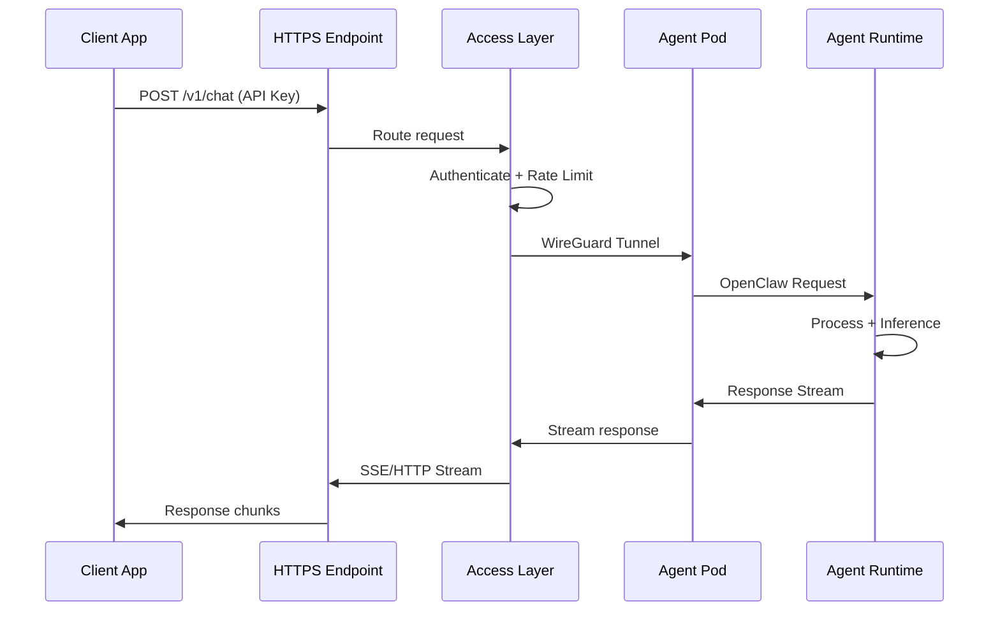

# Connect to Agent

## Overview

Every deployed agent receives a **stable, managed HTTPS endpoint** ready to receive requests immediately.

Connect from anywhere—web browsers, servers, mobile apps, or integrations—using standard APIs.

```
Your App → HTTPS Endpoint → MoltGhost Access Layer → Agent Pod → Response
```

---

## Quick Start

**Get Your Endpoint:**
```bash
moltghost status my-agent --url
# https://abc123.agent.moltghost.io
```

**Test Connection:**
```bash
curl -X POST https://abc123.agent.moltghost.io/v1/chat \
  -H "Authorization: Bearer YOUR_API_KEY" \
  -H "Content-Type: application/json" \
  -d '{
    "messages": [{"role": "user", "content": "Hello, agent!"}],
    "stream": false
  }'

# Response:
# {
#   "id": "msg_123",
#   "content": "Hello! I'm ready to help...",
#   "model": "llama3.1-70b",
#   "usage": {"tokens": 12}
# }
```

---

## Connection Flow



---

## Connection Methods

### **1. OpenAI-Compatible REST API** (Recommended)
```python
from openai import OpenAI

client = OpenAI(
    api_key="molti_xxxxx",
    base_url="https://abc123.agent.moltghost.io/v1"
)

response = client.chat.completions.create(
    model="llama3.1-70b",
    messages=[{"role": "user", "content": "Analyze Q4 sales"}],
    stream=True
)

for chunk in response:
    print(chunk.choices[0].delta.content, end="")
```

### **2. WebSocket (Real-Time Streaming)**
```javascript
const WebSocket = require('ws');

const ws = new WebSocket(
  'wss://abc123.agent.moltghost.io/ws',
  { headers: { 'Authorization': 'Bearer molti_xxxxx' } }
);

ws.on('open', () => {
  ws.send(JSON.stringify({
    action: 'message',
    messages: [{ role: 'user', content: 'Hello!' }]
  }));
});

ws.on('message', (data) => {
  const { content, done } = JSON.parse(data);
  if (content) process.stdout.write(content);
  if (done) ws.close();
});
```

### **3. JavaScript/TypeScript SDK**
```typescript
import { MoltGhostAgent } from '@moltghost/sdk';

const agent = new MoltGhostAgent({
  agentId: 'abc123',
  apiKey: 'molti_xxxxx',
  endpoint: 'https://agent.moltghost.io'
});

const response = await agent.chat('What are my top 3 customers?', {
  stream: true,
  onChunk: (text) => console.log(text)
});

console.log('Total tokens:', response.usage.total_tokens);
```

### **4. Direct HTTP/cURL**
```bash
# Streaming response (SSE)
curl -X POST https://abc123.agent.moltghost.io/v1/chat \
  -H "Authorization: Bearer molti_xxxxx" \
  -d '{
    "messages": [{"role": "user", "content": "..."}],
    "stream": true
  }' \
  --no-buffer
```

---

## Available Endpoints

| Endpoint | Method | Purpose | Stream |
|----------|--------|---------|--------|
| **/v1/chat** | POST | Chat completions | ✅ Yes |
| **/v1/completions** | POST | Text completions | ✅ Yes |
| **/v1/tools** | POST | Invoke skills | ❌ No |
| **/v1/models** | GET | List available models | ❌ No |
| **/v1/health** | GET | Agent status | ❌ No |

---

## Authentication

**API Key Format:**
```
Bearer molti_<account-id>_<token>
```

**Header:**
```
Authorization: Bearer molti_xxxxx
```

**Getting API Keys:**
```bash
# Generate new key
moltghost auth create-key --agent my-agent --name "Production API"
# molti_abc123_xyz789

# List keys
moltghost auth list-keys

# Revoke key (safe for rotation)
moltghost auth revoke-key molti_abc123_xyz789
```

---

## Request/Response Format

**Chat Message:**
```json
{
  "messages": [
    {"role": "system", "content": "You are a sales analyst"},
    {"role": "user", "content": "Analyze this deal"}
  ],
  "stream": true,
  "temperature": 0.7,
  "max_tokens": 2048,
  "tools": ["crm_query", "slack_notify"],
  "timeout_seconds": 300
}
```

**Response (Non-Streaming):**
```json
{
  "id": "msg_abc123",
  "object": "chat.completion",
  "created": 1741264535,
  "model": "llama3.1-70b",
  "finish_reason": "stop",
  "content": "Your top deal is Acme Inc worth $500K...",
  "usage": {
    "prompt_tokens": 45,
    "completion_tokens": 128,
    "total_tokens": 173
  }
}
```

---

## Error Handling

| Status | Error | Resolution |
|--------|-------|------------|
| **401** | `invalid_api_key` | Check API key in Authorization header |
| **403** | `rate_limited` | Wait 60s or upgrade plan |
| **503** | `agent_paused` | `moltghost agent start` to resume |
| **504** | `timeout` | Increase `timeout_seconds` or reduce prompt size |
| **429** | `quota_exceeded` | Monthly token limit reached |

**Error Response:**
```json
{
  "error": {
    "message": "Agent is paused",
    "code": "agent_paused",
    "type": "service_unavailable"
  }
}
```

---

## Endpoint Lifecycle

**Agent State → Endpoint Status:**

| State | Status Code | Response |
|-------|------------|----------|
| **Running** | 200 | ✅ Process normally |
| **Paused** | 503 | Agent unavailable |
| **Initializing** | 202 | Accepted, retry in 60s |
| **Terminated** | 410 | Endpoint permanently gone |

---

## Best Practices

```
✅ Store API keys in environment variables
✅ Use HTTPS only (encryption in transit)
✅ Implement exponential backoff for retries
✅ Stream responses for long generations
✅ Set reasonable timeouts (60-300s)
✅ Monitor token usage for cost control
✅ Rotate API keys monthly
```

---

## Summary

**One Endpoint. Infinite Possibilities.**

✅ **Instant HTTPS connectivity** to any agent  
✅ **OpenAI-compatible API** (drop-in replacement)  
✅ **Multiple connection methods** (REST, WebSocket, SDK)  
✅ **Standard authentication** (Bearer tokens)  
✅ **Production-grade** (SSE streaming, error handling)  

**Connect anything to any agent**—web, mobile, IoT, serverless.

---

*Next: Manage Agents → Scale, pause, update*

**Pro Tip:** Speed up responses 50% by setting `stream: true` and processing chunks as they arrive.
