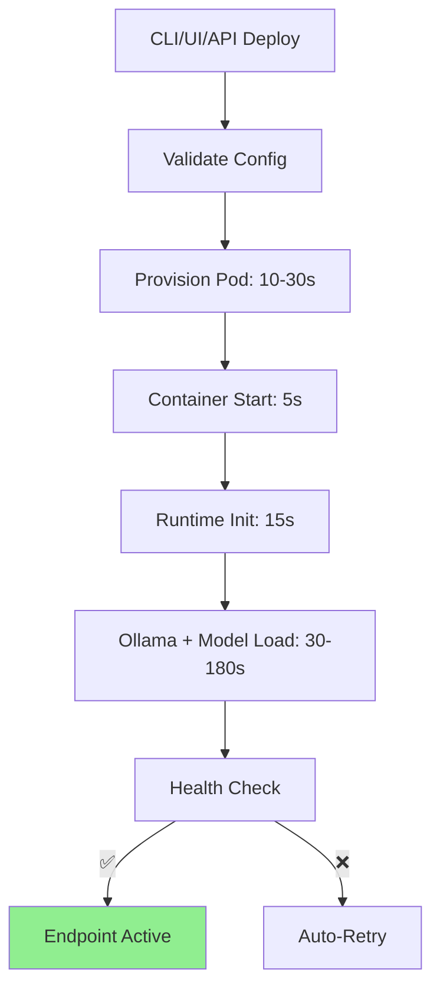

# Deploy an Agent

## Quick Start (30 seconds)

```bash
# Install CLI
npm install -g @moltghost/cli

# Deploy your first agent
moltghost deploy my-agent \
  --model llama3.1-8b-q4 \
  --gpu l40s \
  --memory 24gb

# Get instant endpoint
echo "✅ Agent ready: https://$(moltghost status my-agent --url)/v1/chat"
```

```
🚀 Deployment complete in 45s
📱 Endpoint: https://abc123.agent.moltghost.io
💰 Cost: $0.0017/min (A100 paused)
```

---

## Complete Deployment Flow



**End-to-End Timeline:**

| Model Size | Provision | Model Load | Total |
|------------|-----------|------------|-------|
| **8B** | 20s | 25s | **45s** |
| **70B** | 25s | 90s | **2m15s** |
| **405B** | 40s | 300s | **5m40s** |

---

## Deployment Command Reference

```bash
moltghost deploy AGENT_NAME [options]

# Core Options
--model llama3.1-70b-q4           # LLM (20+ supported)
--gpu l40s \| a100 \| h100        # Compute tier
--memory 24gb \| 80gb             # System RAM
--storage 50gb                    # Persistent volume

# Advanced
--region ap-southeast-1           # Jakarta (low latency)
--replicas 3                      # HA deployment
--auto-pause 15m                  # Cost optimization
--skills ./my-skills/             # Private tools
--env KEY=secret                  # Environment vars

# Examples
moltghost deploy sales-agent --model qwen2.5-72b --gpu h100 --region jakarta
moltghost deploy dev-chat --model phi3-mini --cpu --memory 16gb --free-tier
```

---

## Step-by-Step Process

### 1. **Configuration** (Instant)
```bash
# Define agent spec
cat > agent.yaml
name: sales-assistant
model: llama3.1-70b-q4
resources:
  gpu: a100
  memory: 80gb
  storage: 100gb
skills: ["crm", "slack"]
env:
  CRM_API_KEY: secret
```

### 2. **Pod Provisioning** (10-30s)
```
✓ Allocating GPU (A100-80GB)
✓ Mounting 80GB RAM  
✓ Creating 100GB NVMe volume
✓ Internal networking (WireGuard)
Pod abc123 ready ✓
```

### 3. **Runtime Initialization** (15s)
```
✓ OpenClaw framework v1.2.3
✓ Ollama server starting
✓ Skills loaded: crm_query, slack_notify
Runtime healthy ✓
```

### 4. **Model Loading** (30-180s)
```
⬇️ Downloading llama3.1-70b-q4... 42GB / 42GB
🔄 Loading to GPU memory (Q4_K_M 38GB)
⚡ Warming inference engine
Model ready ✓ 1.2s/token
```

### 5. **Endpoint Activation** (Instant)
```
✅ Agent fully deployed!
📱 https://abc123.agent.moltghost.io
🔗 OpenAI compatible: /v1/chat, /v1/completions
💰 Current rate: $0.0417/hour
```

---

## Deployment States

| State | Duration | Endpoint | Billing | Action |
|-------|----------|----------|---------|--------|
| **Pending** | 0-10s | 404 | No | Provisioning |
| **Provisioning** | 10-60s | 202 Accepted | Yes | Pod setup |
| **Initializing** | 1-3m | 503 | Yes | Runtime + model |
| **Healthy** | ∞ | 200 OK | Yes | ✅ Ready |
| **Paused** | ∞ | 503 | Storage only | `moltghost pause` |

**Real-time Status:**
```bash
moltghost status my-agent --watch
# 14:32:15  Initializing (87%)  Model loading 72%
# 14:32:45  ✅ Healthy  Endpoint active  Uptime 0m
```

---

## Production Deployment Patterns

### **High Availability**
```bash
moltghost deploy prod-agent \
  --replicas 3 \
  --region ap-southeast-1 \
  --auto-scale cpu>80 \
  --healthcheck /v1/health
```

### **Cost-Optimized Development**
```bash
moltghost deploy dev-agent \
  --model phi3-mini-q4 \
  --cpu \
  --memory 16gb \
  --auto-pause 10m \
  --backup daily
```

### **Enterprise Multi-Region**
```bash
moltghost deploy global-agent \
  --model llama3.1-405b \
  --gpu h100 \
  --replicas 2 \
  --region ap-southeast-1 \
  --region us-east-1 \
  --backup cross-region
```

---

## Troubleshooting

| Issue | Symptom | Solution |
|-------|---------|----------|
| **Slow Model Load** | >5min | `moltghost logs --model-load` |
| **Pod Provision Fail** | "No capacity" | `--region alternate` or `--gpu-priority` |
| **OOM Error** | "CUDA out of memory" | `--memory +16gb` or `--quantize q4` |
| **Skill Not Found** | 404 on tools | `skills list --verify` |

---

## Summary

**Deploy → Ready in `<3` minutes** with production-grade infrastructure.

✅ **One-command deployment** (CLI/UI/API)  
✅ **30s-5m** total time (model dependent)  
✅ **Automatic HTTPS endpoints**  
✅ **Cost controls** built-in  
✅ **Production patterns** (HA, multi-region)  

**From zero to intelligent agent** in one command.

---

*Next: Manage Agents → Scale, pause, update*

**Test Immediately:**
```bash
curl -X POST https://YOUR-AGENT.agent.moltghost.io/v1/chat \
  -d '{"messages":[{"role":"user","content":"Hello!"}]}'
```
