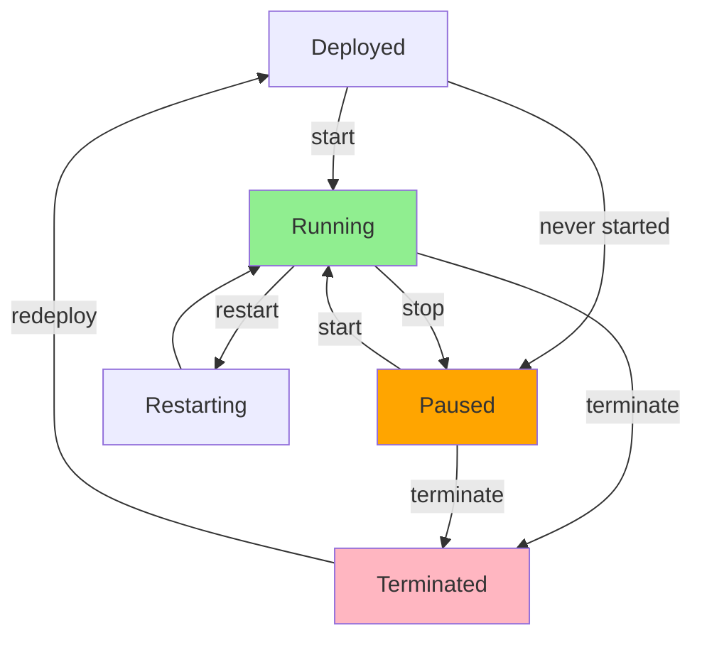

# Manage Agents

## Agent Lifecycle Controls

Control compute costs and agent availability with simple commands:

```bash
moltghost agent start   my-agent     # ▶️  Full compute
moltghost agent stop    my-agent     # ⏸️  Storage only (-95% cost)
moltghost agent restart my-agent     # 🔄 Fresh runtime  
moltghost agent delete  my-agent     # 🗑️  Release all resources
```

**Live Status:**
```bash
moltghost agent status my-agent --watch
# NAME: sales-agent  STATUS: Running  UPTIME: 2h14m  GPU: 23%  COST: $0.0417/h
```

---

## State Machine



---

## Management Operations

| Command | Purpose | Compute Cost | Endpoint | Data |
|---------|---------|--------------|----------|------|
| **`start`** | Launch runtime + model | ✅ Full | ✅ Active | Preserved |
| **`stop`** | Pause runtime | ❌ GPU/CPU ✅ Storage | 503 Unavailable | **Preserved** |
| **`restart`** | Fresh runtime init | Brief double | Brief 503 | **Preserved** |
| **`delete`** | Destroy pod | ❌ None | Gone | **Backup only** |

### **Start Agent**
```bash
moltghost agent start my-agent
# ▶️  Starting runtime... (45s)
# ✅ Model loaded  Endpoint: https://abc123.agent.moltghost.io
```

### **Stop Agent** (Saves 95% cost)
```bash
moltghost agent stop my-agent
# ⏸️  Pausing... State saved
# 💰 GPU released  Storage only: $0.0021/h
```

### **Restart Agent** (Zero downtime option)
```bash
moltghost agent restart my-agent --graceful
# 🔄 Rolling restart initiated
# ✅ New pod healthy  0s downtime
```

### **Terminate Agent**
```bash
moltghost agent delete my-agent --confirm
# 🗑️  Pod terminated  Resources released
# 📋 Backup available for 30 days
```

---

## Cost Impact Dashboard

```
Current Month: 12 Agents
┌─────────────────────┬──────────┬──────────┐
│ Agent               │ State    │ Cost/h   │
├─────────────────────┼──────────┼──────────┤
│ sales-agent         │ Running  │ $0.0417  │
│ dev-chat            │ Paused   │ $0.0021  │
│ qa-bot              │ Running  │ $0.0234  │
│ legacy-agent        │ Paused   │ $0.0012  │
├─────────────────────┼──────────┼──────────┤
│ TOTAL RUNNING       │          │ $0.0891  │
│ TOTAL PAUSED        │          │ $0.0078  │
│ SAVINGS FROM PAUSE  │          │ **$1.24**│
└─────────────────────┴──────────┴──────────┘
```

**Bulk Operations:**
```bash
# Pause all dev agents
moltghost agent stop dev-* --batch

# Start production agents
moltghost agent start prod-* --batch

# Cleanup terminated
moltghost cleanup --age 7d
```

---

## Advanced Management

### **Auto-Pause Policies**
```bash
moltghost agent set my-agent \
  --auto-pause "cpu<5% for 15m" \
  --auto-start "cron 09:00-17:00 WIB"
```

### **Health-Based Actions**
```bash
moltghost agent set prod-agent \
  --restart-if "gpu_temp>85C or error_rate>5%" \
  --alert-slack "#ops"
```

### **Blue-Green Deployments**
```bash
moltghost deploy sales-v2 \
  --traffic 10% \          # Canary testing
  --auto-promote-healthy
```

---

## State Transitions Table

| From → To | start | stop | restart | delete |
|-----------|-------|------|---------|--------|
| **Running** | - | ✅ Pause | ✅ Refresh | ✅ Destroy |
| **Paused** | ✅ Resume | - | ✅ Resume+Refresh | ✅ Destroy |
| **Terminated** | ❌ Redeploy | ❌ | ❌ | - |
| **Deploying** | ⏳ Wait | ❌ | ❌ | ✅ Cancel |

**Data Safety:**
```
✅ start/stop/restart → 100% state preserved
✅ delete → Backup retained 30 days (Pro)
✅ Accident? → moltghost restore --latest
```

---

## Monitoring Integration

```
Live Dashboard: https://app.moltghost.io/agents
┌──────────────┬──────────────┬────────────┐
│ Agent        │ Status       │ Action     │
├──────────────┼──────────────┼────────────┤
│ sales-agent  │ 🟢 Running   │[⏸️][🔄][🗑️]│
│ dev-chat     │ 🟡 Paused    │[▶️][🔄][🗑️] │
│ qa-bot       │ 🔴 Failed    │[🔄][🗑️]    │
└──────────────┴──────────────┴────────────┘
```

**CLI Watch Mode:**
```bash
moltghost agent watch "*" --cost --alerts
```

---

## Summary

**Full Lifecycle Control** in 1 command:

✅ **`start/stop`** → 95% cost savings  
✅ **`restart`** → Zero-downtime updates  
✅ **Auto-policies** → Hands-free optimization  
✅ **Bulk ops** → Manage 100+ agents  
✅ **State guarantees** → Never lose data  

**Run production, pause dev, scale smart.**

---

*Next: Update & Versioning → Schema changes, rollbacks*

**Power User:** `moltghost agent stop --idle` across all accounts saves $100s/month.
