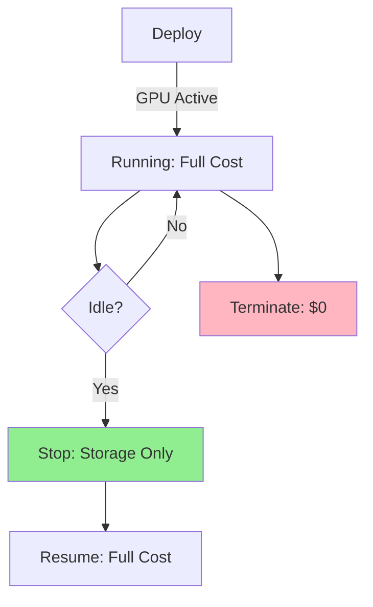
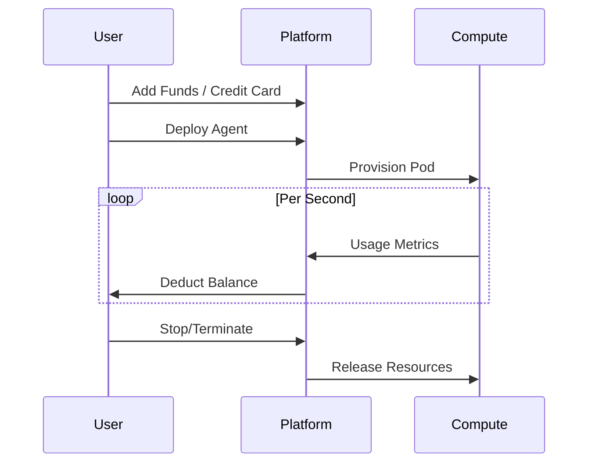

# Payment & Billing

## Overview

MoltGhost uses **usage-based billing** for compute resources consumed by Agent Pods.

Pay only for what you use—billed per-second with no long-term commitments.

```
Deploy → Allocate GPU/Memory → Run → Pay per Second → Stop → Billing Pauses
```

---

## Pricing Model

**Per-Second Compute Billing** across all resources:

| Resource | Price (per hour) | Min Allocation | Notes |
|----------|------------------|----------------|-------|
| **GPU** | | | |
| NVIDIA L40S | $0.80 | 1 GPU | 7B-30B models |
| NVIDIA A100 80GB | $2.50 | 1 GPU | 70B models |
| NVIDIA H100 80GB | $4.20 | 1-8 GPU | 405B+ models |
| **CPU/Memory** | | | |
| 8 vCPU + 32GB | $0.15 | 2 vCPU | Lightweight agents |
| 32 vCPU + 128GB | $0.60 | 8 vCPU | Heavy tooling |
| **Storage** | | | |
| NVMe SSD | $0.15/GB | 50GB | Model weights + data |

**Example Costs:**
```
Llama 70B Agent (A100):
- Running 24h: $60/day
- Paused: $1.20/day (storage only)
- First 100s free trial
```

---

## Billing Dimensions

```
Total Cost = Σ(Resource × Duration × Rate)
```

| State | GPU/CPU | Memory | Storage | Networking |
|-------|---------|--------|---------|------------|
| **Running** | ✅ Billed | ✅ Billed | ✅ Billed | Per GB |
| **Paused** | ❌ Idle | ❌ Idle | ✅ Billed | ❌ Idle |
| **Deploying** | ⏳ Billed | ⏳ Billed | ✅ Billed | ❌ Idle |
| **Terminated** | ❌ None | ❌ None | ❌ None | ❌ None |

**Free Tier:** First 100 seconds + 5GB storage across all agents.

---

## Cost Management Dashboard

```
┌─────────────────────────────────────────────────────────────┐
│                      Billing Dashboard                       │
├─────────────────────┬─────────────────────┬─────────────────┤
│   Agent Usage       │     Cost Breakdown  │   Cost Control  │
├─────────────────────┼─────────────────────┼─────────────────┤
│ -  llama-agent     │ -  GPU: $45.20 (75%) │ [⏸️ Pause All] │
│   120h @ A100     │ -  Memory: $8.40     │ [🗑️ Delete Idle]│
│ -  qwen-bot        │ -  Storage: $2.10    │ [⚙️ Set Budget] │
│   80h @ L40S      │ -  Network: $1.30   │ [$50/mo Limit] │
│ Total: $78.45     │ Total: $57/mo      │                 │
└─────────────────────┴─────────────────────┴─────────────────┘
```

**Live Metrics:**
```bash
moltghost billing usage --live
# Agent: my-agent  Cost: $0.023/min  GPU: 85%  Est. Monthly: $33.12
```

---

## Lifecycle Cost Control



**Cost-Saving Commands:**
```bash
# Pause idle agents (saves 95% cost)
moltghost agent stop my-agent-qa

# Auto-pause after inactivity
moltghost agent set my-agent --auto-pause 15m

# Delete terminated pods
moltghost cleanup --orphans
```

---

## Payment Flow



**Funding Options:**
- Credit Card (instant)
- Bank Transfer (IDR/WIB, 1-2 days)
- Crypto (USDC, instant)
- Enterprise Invoicing

**Minimum Balance:** $5 (auto-recharge available)

---

## Detailed Billing Example

**70B Llama Agent, 1 month mixed usage:**

```
Week 1: 24/7 Production     → 168h × $2.50 = $420
Week 2: 12h/day Work Hours → 84h × $2.50 = $210  
Week 3: Paused (storage)   → 0 GPU + $2.10 = $2.10
Week 4: Testing 4h/day     → 28h × $2.50 = $70
Network: 150GB × $0.10     → $15
───────────────────────────────────────
Total: $717.10/mo
```

**Optimization:** Auto-pause → **$250/mo savings (65%)**

---

## Summary

**Transparent, Predictable Compute Billing:**

✅ **Per-second granularity** (no hourly minimums)  
✅ **Live cost dashboard** + alerts  
✅ **Lifecycle controls** save 50-90%  
✅ **Free trial seconds** for testing  
✅ **Multi-currency** + enterprise billing  

**Deploy with confidence**—pause anytime, scale intelligently, pay precisely.

---

*Next: Enterprise Features → SSO, VPC Peering, Dedicated Clusters*

**Pro Tip:** Set `--auto-pause 30m` on dev agents to eliminate idle costs.
