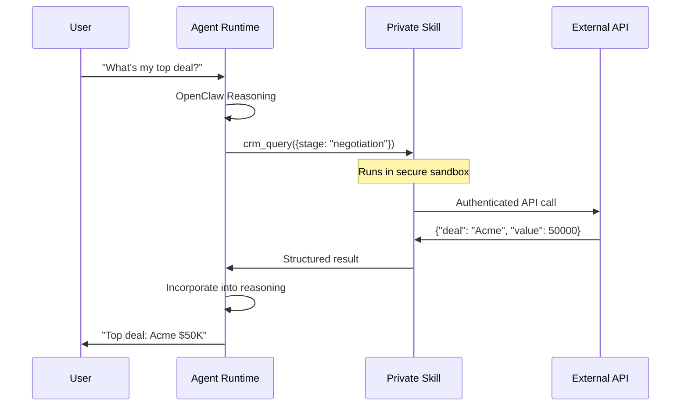

# Private Skills

## Overview

**Private Skills** extend agent intelligence with custom, user-owned capabilities.

Skills are secure functions that agents invoke during reasoning—unlocking access to private APIs, databases, and automation without public exposure.

```
Agent: "Check my Q4 sales pipeline"
↓ Reasoning → "Need CRM data"
↓ Invoke Private Skill: crm_query()
↓ Returns: [{"deal": "Acme", "value": "$50K", "stage": "Negotiation"}]
↓ Agent: "Your top deal is Acme at $50K—recommend closing strategy..."
```

---

## Skill Architecture

```
┌─────────────────────────────────────────────────────────────┐
│                    Agent Runtime                             │
├─────────────────────────────────────────────────────────────┤
│  ┌─────────────────┐                                        │
│  │ OpenClaw        │◄──── User Request ────────────────────│
│  │ Reasoning       │                                        │
│  └─────────────────┘                                        │
│           │                                                 │
│           ▼                                                 │
│  ┌─────────────────┐  ┌─────────────────────────────┐       │
│  │ Skill Router    │──│    Private Skills            │       │
│  └─────────────────┘  │                              │       │
│                       │ -  crm_query()               │       │
│                       │ -  warehouse_inventory()     │       │
│                       │ -  slack_notify()            │       │
│                       │ -  github_pr_review()        │       │
│                       └─────────────────────────────┘       │
│                                                              │
│  ✅ User-scoped access only                                 │
│  ✅ Encrypted credentials                                   │
│  ✅ Audit logging                                           │
└──────────────────────────────────────────────────────────────┘
```

---

## Defining Private Skills

**Skills are pure functions** with structured schema:

```typescript
// Example: CRM Query Skill
const crmSkill = {
  name: "crm_query",
  description: "Query customer pipeline data",
  parameters: {
    type: "object",
    properties: {
      stage: {type: "string", enum: ["prospect", "negotiation", "closed"]},
      minValue: {type: "number", minimum: 1000}
    }
  },
  execute: async ({stage, minValue}) => {
    // Your private CRM API call
    const deals = await fetchPrivateCRM(stage, minValue);
    return {deals, totalValue: deals.reduce((sum, d) => sum + d.value, 0)};
  }
};
```

**Deploy to Agent:**
```bash
moltghost skills add my-agent --file crm-skill.ts
```

---

## Execution Flow



**Agent Reasoning Loop:**
```
1. Observe: User wants CRM data
2. Plan: Call crm_query skill
3. Act: Execute with parameters  
4. Observe: Parse structured results
5. Reason: Generate natural response
```

---

## Skill Isolation & Security

```
┌─────────────────────────────────────────────────────────────┐
│                    Zero Trust Skills                         │
├─────────────────────────────────────────────────────────────┤
│  ✅ Owner-scoped: Only your agents access your skills       │
│  ✅ Credential isolation: Secrets never leave your account  │
│  ✅ Sandbox execution: No direct compute access             │
│  ✅ Structured I/O: Type-safe contracts                     │
│  ✅ Audit trail: Every invocation logged                    │
│  ✅ Rate limited: Prevent abuse                             │
└─────────────────────────────────────────────────────────────┘
```

**Multi-Tenant Safety:**
```
User A Skills → Only Agent A pods
User B Skills → Only Agent B pods
No cross-access possible
```

---

## Pre-Built Skills Library

| Category | Skills | Private Equivalent |
|----------|--------|-------------------|
| **CRM** | `hubspot_query()`, `salesforce_list()` | ✅ Your CRM instance |
| **Comms** | `slack_post()`, `email_send()` | ✅ Your workspace |
| **Code** | `github_pr()`, `git_clone()` | ✅ Your repos |
| **Data** | `postgres_query()`, `s3_list()` | ✅ Your database/buckets |
| **Finance** | `stripe_invoice()`, `quickbooks_report()` | ✅ Your accounts |

**Customization:** Fork any skill → Add your auth → Deploy privately.

---

## Development Workflow

```
1. Write skill (TypeScript/Python)
2. Test locally: moltghost skills test crm-skill.ts
3. Deploy: moltghost skills add my-agent crm-skill
4. Agent auto-discovers via OpenAPI schema
5. Use: Agent automatically calls during reasoning
```

**Live Reload:**
```bash
moltghost skills update my-agent crm-skill  # Zero downtime
```

---

## Real-World Examples

```
**E-Commerce Agent:**
Skills: inventory_check(), order_create(), shiprocket_track()

**DevOps Agent:** 
Skills: github_deploy(), k8s_scale(), datadog_alerts()

**Finance Agent:**
Skills: xero_reports(), stripe_payouts(), bank_reconcile()
```

---

## Summary

**Private Skills = Your Agent's Superpowers**

✅ **Custom functions** for private infrastructure  
✅ **Automatic discovery** by reasoning engine  
✅ **Secure execution** (sandbox + encryption)  
✅ **Structured I/O** for reliable integration  
✅ **Zero cross-tenant leakage**  

**Extend any agent** with your private tools in 5 minutes.

---

*Next: Scaling Strategies → Multi-agent orchestration*

**Quick Start:**
```bash
echo 'export async function weather(city) { ... }' > weather-skill.js
moltghost skills add my-agent weather-skill.js
# Agent can now answer: "What's the weather in Bandung?"
```
